# MerolynMejia_20250827_P2

## Infraestructura 1 - VPN IPsec Site-to-Site entre dos FortiGate

**Estudiante:** Merolyn Mejía  
**Matrícula:** 2025-0827  

---

## 🎥 Video demostrativo

**Enlace del video:**  
https://youtu.be/VYO3u3gqH28

---

## 📑 Índice

1. [Propósito del laboratorio](#propósito-del-laboratorio)
2. [Topología](#topología)
3. [Direccionamiento IP](#direccionamiento-ip)
4. [Configuración del FGT-USUARIOS](#configuración-del-fgt-usuarios)
5. [Configuración del FGT-SERVIDOR](#configuración-del-fgt-servidor)
6. [Enrutamiento](#enrutamiento)
7. [Políticas de firewall y NAT](#políticas-de-firewall-y-nat)
8. [VPN IPsec Site-to-Site](#vpn-ipsec-site-to-site)
9. [Pruebas de funcionamiento](#pruebas-de-funcionamiento)
10. [Conclusión](#conclusión)
11. [Archivos del repositorio](#archivos-del-repositorio)

---

## Propósito del laboratorio

El propósito de este laboratorio es implementar una VPN IPsec Site-to-Site entre dos firewalls FortiGate en GNS3, permitiendo la comunicación segura entre una red de usuarios y una red de servidores.

La infraestructura fue configurada con direccionamiento basado en la matrícula **2025-0827**. También se configuraron interfaces LAN y WAN, DHCP, rutas, políticas de firewall, NAT y el túnel VPN IPsec.

Una parte importante de la práctica consiste en demostrar que los equipos de ambas redes pueden comunicarse mediante las políticas y el túnel VPN configurado.

---

## Topología

La infraestructura está formada por:

- 2 FortiGate.
- 1 VPCS para representar al usuario.
- 1 servidor.
- 1 switch para la red WAN.
- 1 conexión NAT/ISP.
- 1 túnel VPN IPsec Site-to-Site.

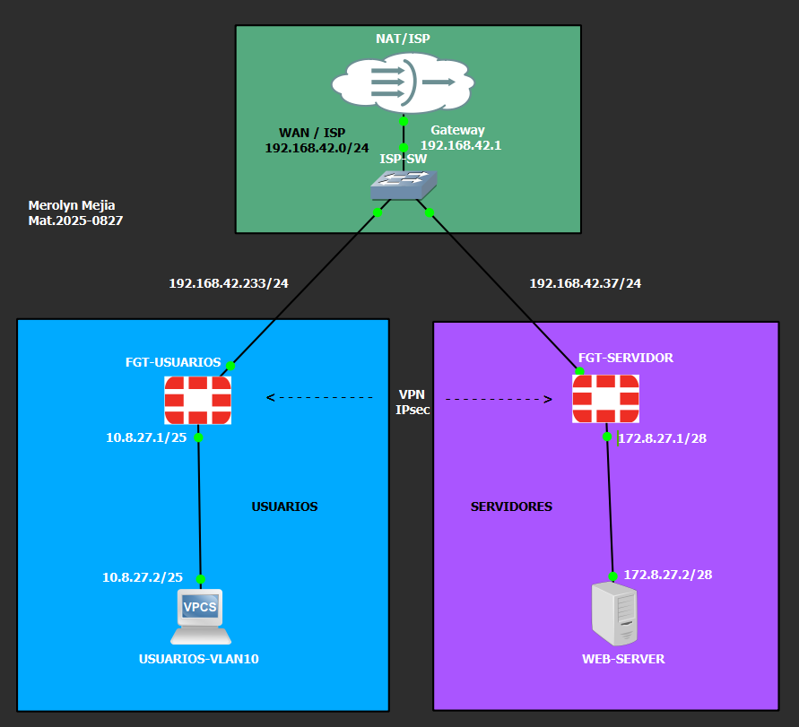

---

## Direccionamiento IP

| Dispositivo | Interfaz/Función | Dirección IP |
|---|---|---|
| NAT/ISP | Gateway WAN | 192.168.42.1 |
| FGT-USUARIOS | port1 / WAN | 192.168.42.233/24 |
| FGT-USUARIOS | USUARIOS-VLAN10 / LAN | 10.8.27.1/25 |
| USUARIOS-VLAN10 | Cliente | 10.8.27.2/25 |
| FGT-SERVIDOR | port1 / WAN | 192.168.42.37/24 |
| FGT-SERVIDOR | SERVIDORES / LAN | 172.8.27.1/28 |
| WEB-SERVER | Servidor | 172.8.27.2/28 |

Las redes internas utilizan como referencia los últimos dígitos de la matrícula **2025-0827**, específicamente `8.27`.

---

# Configuración del FGT-USUARIOS

## Interfaz WAN

La interfaz `port1` del FGT-USUARIOS obtiene mediante DHCP la dirección:

**192.168.42.233/24**

El gateway utilizado es:

**192.168.42.1**

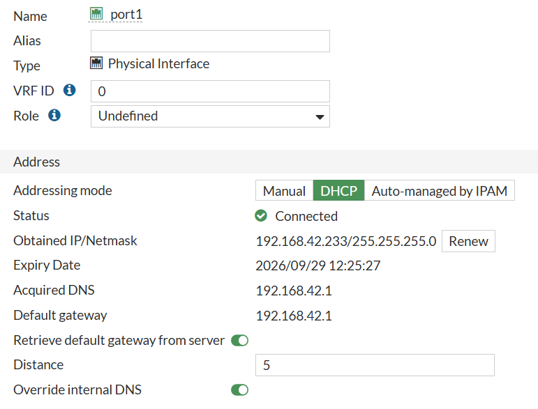

---

## Interfaz LAN de usuarios

La interfaz correspondiente a la red de usuarios fue configurada con:

- **Nombre:** USUARIOS-VLAN10
- **Interfaz:** port3
- **Dirección:** 10.8.27.1/25
- **Rol:** LAN
- **PING:** habilitado

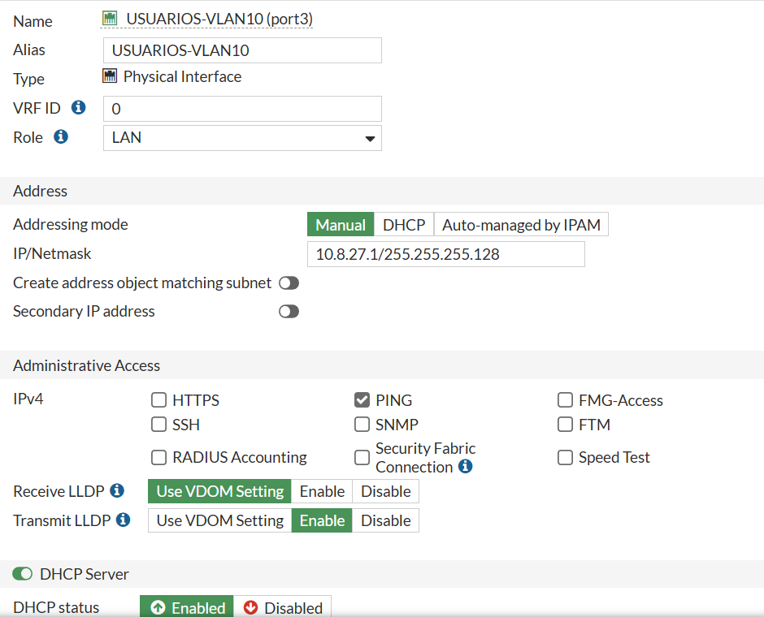

---

## DHCP para usuarios

Se habilitó DHCP en la red de usuarios para asignar automáticamente las direcciones IP a los clientes.

**Rango DHCP:**
10.8.27.2 - 10.8.27.126

**Máscara:**
255.255.255.128

**Gateway:**
10.8.27.1

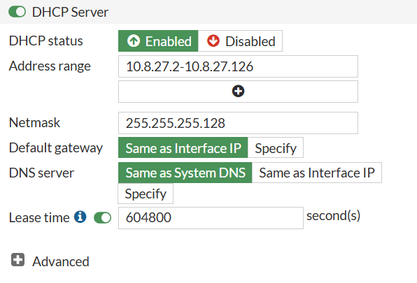

---

## Dirección obtenida por el usuario

El equipo `USUARIOS-VLAN10` obtiene correctamente una dirección IP perteneciente a la red de usuarios.

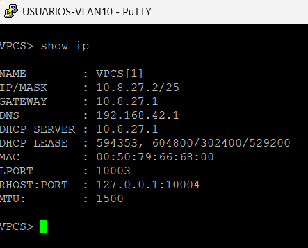

---

# Configuración del FGT-SERVIDOR

## Interfaz WAN

La interfaz `port1` del FGT-SERVIDOR obtiene:

**192.168.42.37/24**

Gateway:

**192.168.42.1**

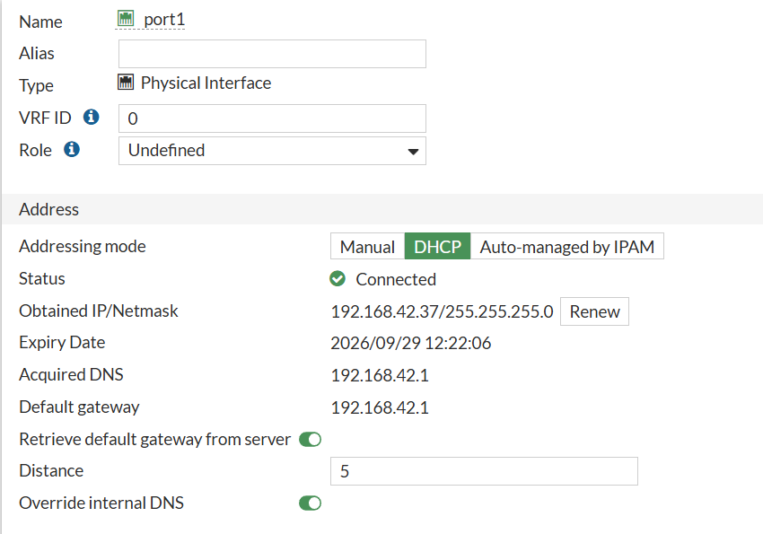

---

## Interfaz LAN de servidores

La interfaz de servidores fue configurada con:

- **Nombre:** SERVIDORES
- **Interfaz:** port3
- **Dirección:** 172.8.27.1/28
- **Rol:** LAN
- **PING:** habilitado

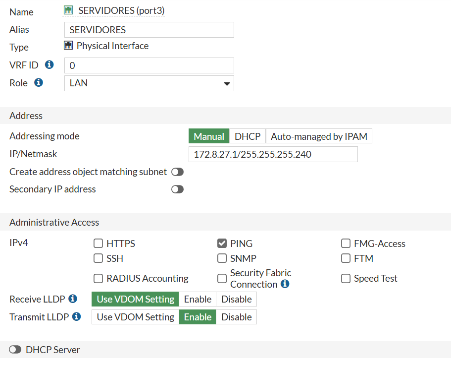

---

## WEB-SERVER

El servidor utiliza la dirección:

172.8.27.2/28

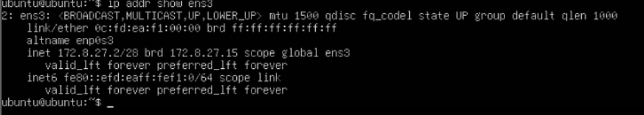

La ruta por defecto del servidor apunta hacia el FortiGate:

default via 172.8.27.1

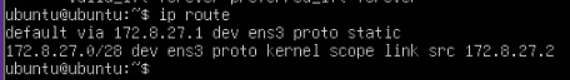

---

# Enrutamiento

## Rutas del FGT-USUARIOS

El FGT-USUARIOS posee una ruta hacia la red remota de servidores mediante el túnel `VPN-USER-SERVER`.

Las redes principales son:

0.0.0.0/0
10.8.27.0/25
172.8.27.0/28
192.168.42.0/24

La red remota:

172.8.27.0/28

es alcanzada mediante la VPN.

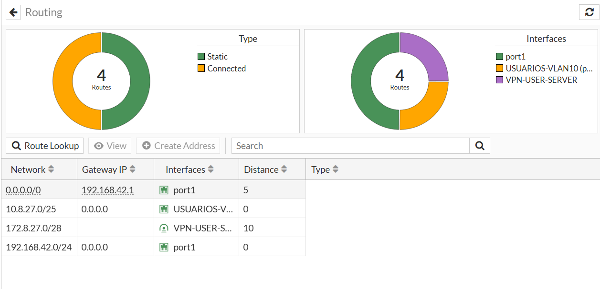

---

## Rutas del FGT-SERVIDOR

El FGT-SERVIDOR posee una ruta hacia:

10.8.27.0/25

mediante el túnel `VPN-SERVER-USER`.

La red:

172.8.27.0/28

se encuentra directamente conectada al FortiGate.

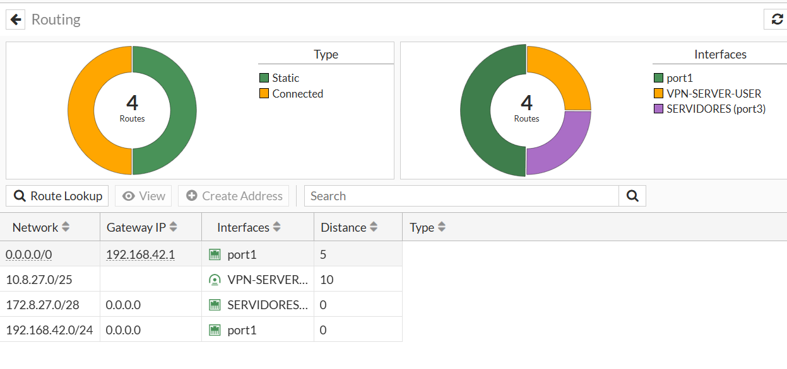

---

# Políticas de firewall y NAT

## FGT-USUARIOS

Se configuraron políticas para permitir la comunicación entre la red de usuarios, Internet y el túnel VPN.

La política:

USUARIOS-VLAN10 → port1

utiliza **NAT Enabled** para el acceso a Internet.

La política:

USUARIOS-VLAN10 → VPN-USER-SERVER

utiliza **NAT Disabled**, permitiendo conservar las direcciones originales durante la comunicación entre las redes privadas.

También existe la política de retorno:

VPN-USER-SERVER → USUARIOS-VLAN10

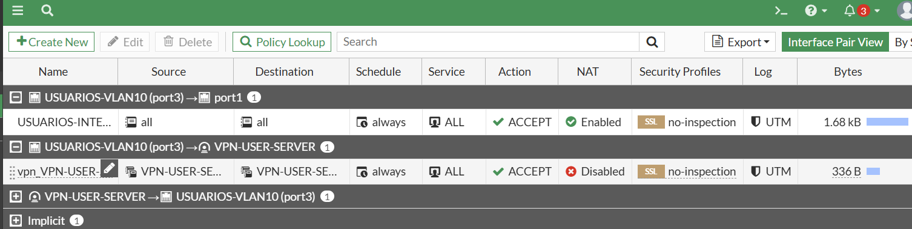

---

## FGT-SERVIDOR

En el segundo FortiGate se configuraron las políticas correspondientes a la red de servidores.

La política hacia Internet utiliza NAT, mientras que la comunicación a través de la VPN se mantiene sin NAT.

También se configuró la política de retorno desde el túnel hacia la red de servidores.

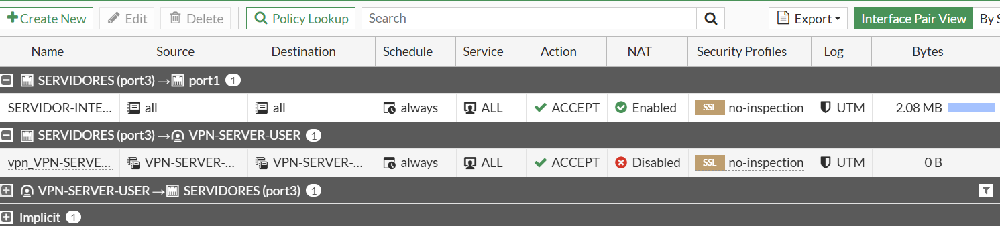

---

# VPN IPsec Site-to-Site

Se configuró una VPN **IPsec Site-to-Site** entre los dos FortiGate.

### Lado Usuarios

VPN-USER-SERVER

La VPN utiliza `port1` como interfaz WAN y se encuentra en estado **Up**.

### Lado Servidor

VPN-SERVER-USER

El túnel también se encuentra en estado **Up**.

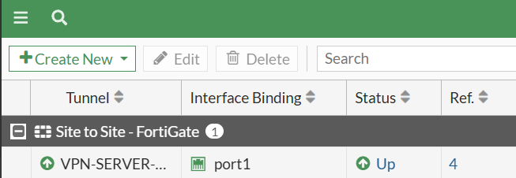

Esto confirma que ambos extremos del túnel IPsec fueron establecidos correctamente.

---

# Pruebas de funcionamiento

## Prueba 1 - Comunicación con la VPN operativa

Desde `USUARIOS-VLAN10` se realizó:

ping 172.8.27.2

El WEB-SERVER respondió correctamente.

En la misma evidencia se observan los túneles IPsec en estado **Up**.

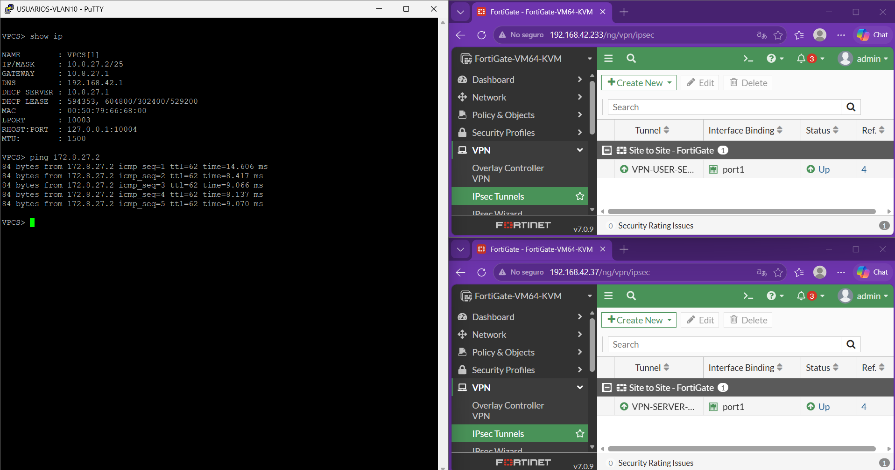

**Resultado:** comunicación exitosa entre la red de usuarios y la red de servidores.

---

## Prueba 2 - Bloqueo del tráfico

Para comprobar el control del tráfico, se deshabilitó temporalmente la política:

USUARIOS-VLAN10 → VPN-USER-SERVER

Al ejecutar nuevamente:

ping 172.8.27.2

se obtuvieron respuestas:

timeout

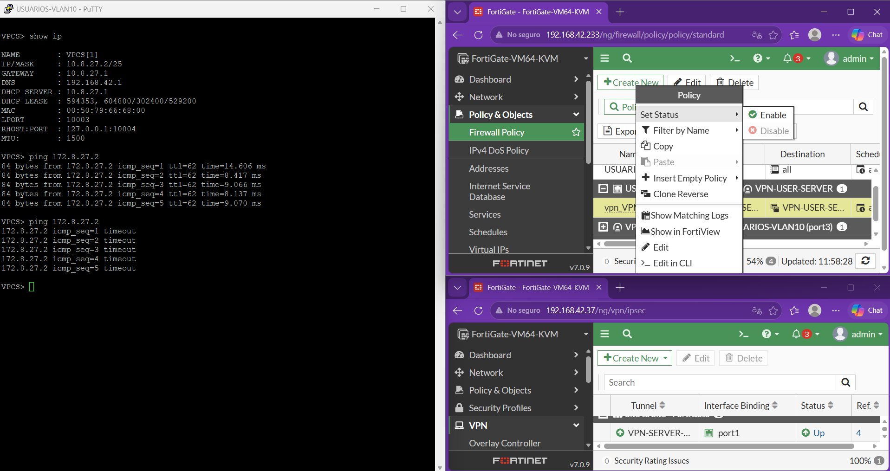

Esto demuestra que aunque la infraestructura VPN esté configurada, las políticas de firewall determinan si el tráfico puede atravesar el FortiGate.

---

## Prueba 3 - Restauración de la comunicación

Se volvió a habilitar la política de firewall y se realizó nuevamente:

ping 172.8.27.2

La comunicación fue restaurada correctamente.

Por lo tanto, las pruebas muestran el comportamiento esperado que seria que mientras la politica esta habilitada, la comunicación esta permitida y en cuanto se desactiva, la comunicación es bloqueada pero en cuanto la habilitamos de nuevo, la comunicación queda restaurada

---

# Conclusión

En esta práctica se implementó una infraestructura con dos FortiGate conectados mediante una VPN IPsec Site-to-Site. Se configuraron las redes de usuarios y servidores, el direccionamiento IP, DHCP, rutas, políticas de firewall y NAT.

Las pruebas permitieron comprobar que el usuario de la red `10.8.27.0/25` puede comunicarse con el servidor ubicado en la red `172.8.27.0/28` cuando las políticas necesarias están habilitadas. Al deshabilitar la política que permite el tráfico hacia la VPN, la comunicación fue bloqueada y, al habilitarla nuevamente, fue restaurada.

Con esto se comprobó de manera práctica el funcionamiento del túnel IPsec y la importancia de las políticas de firewall para controlar el tráfico entre ambas redes.

---

# Archivos del repositorio

La carpeta **Imagenes** contiene las evidencias visuales utilizadas en esta documentación.

La carpeta **Scripts** contiene los scripts utilizados durante la configuración del laboratorio.

La carpeta **Running-Configs** contiene las configuraciones exportadas de los dispositivos FortiGate.
